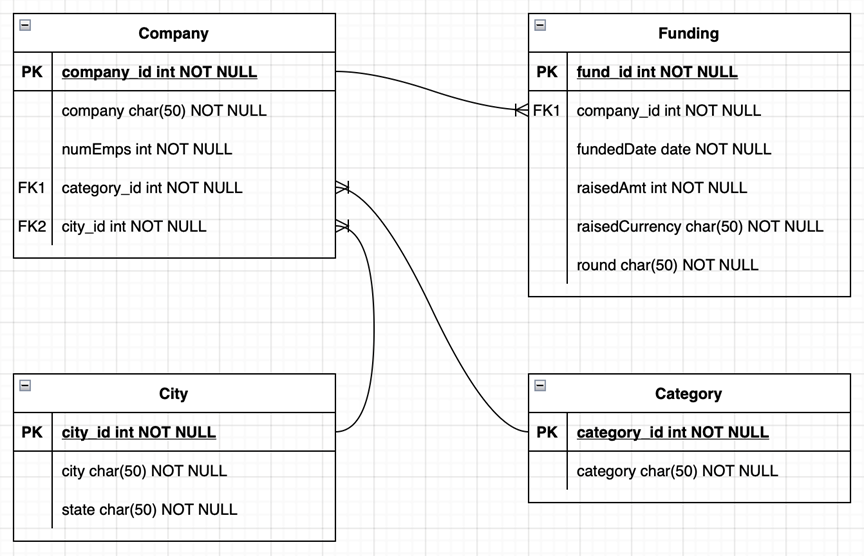
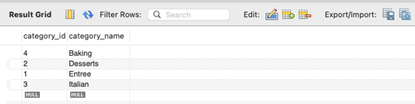
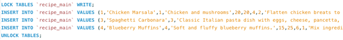
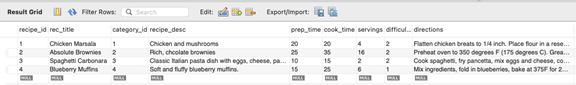
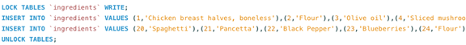
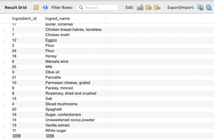
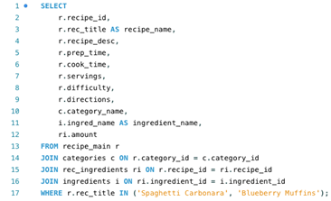
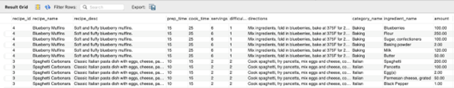
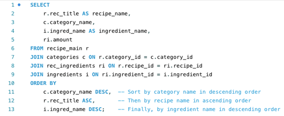
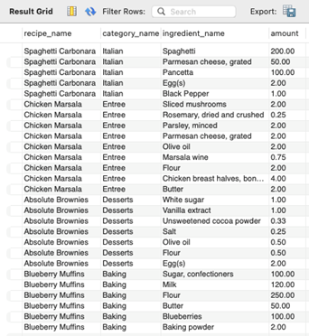

# S-Project 2: TechCrunch Dataset Normalization & Recipe Database SQL Operations (MySQL)

This project includes two major components:

1. **Full normalization of the TechCrunch startup funding dataset** (1NF → 3NF)  
2. **Practical SQL operations** on a recipe database, including INSERT, SELECT (multi-table join), and relationship management.

It demonstrates data modeling, functional dependency analysis, ERD creation, and SQL proficiency.

* **Dataset 1:** TechCrunch Startup Funding (CSV)  
* **Dataset 2:** Recipe Database (recipe_main, category, ingredients, rec_ingredients)  
* **Tools:** MySQL, SQL, ERD modelling  
* **Techniques:** 1NF/2NF/3NF validation, dependency resolution, SQL INSERT/SELECT queries  
* **Goal:** Convert an unnormalized dataset into a clean relational schema and demonstrate SQL proficiency through real operations.

---

# 🧩 Part 1 — TechCrunch Dataset Normalization (1NF → 3NF)

The TechCrunch dataset contains funding event records (company, date, category, state, etc.).  
Goal: Identify primary keys, verify normal forms, and produce a fully normalized schema.

---

## 🔑 **Choosing the Primary Key**

A good primary key:  
- **fund_id** → unique for each funding event  
Invalid primary keys:  
- `company` → appears multiple times  
- Composite (`company`, `fundedDate`) → duplicates possible

---

## ✔ 1NF — First Normal Form

- All fields contain **atomic values**  
- No multi-valued fields  
- `fund_id` ensures row uniqueness  

➡ **Dataset satisfies 1NF**

---

## ✔ 2NF — Second Normal Form

- Primary key is a **single attribute** → `fund_id`  
- No partial dependencies possible  

➡ **Dataset satisfies 2NF**

---

## ❌ 3NF Violation — Before Normalization

There are **transitive dependencies**, e.g.:

- `state` depends on `city`  
- `category` is not decomposed into its own entity  

➡ Dataset **not in 3NF**.

---

# 🧱 **Normalized 3NF Schema**

The dataset is decomposed into **four entities**:

### **📌 Company Table**
| Column | Type | Notes |
|--------|-------|---------|
| company_id | PK | Unique ID |
| company | text | Company name |
| numEmps | int | Employees |
| category_id | FK | → Category |
| city_id | FK | → City |

### **📌 Funding Table**
| Column | Type | Notes |
|--------|-------|---------|
| fund_id | PK | Funding event |
| company_id | FK | → Company |
| fundedDate | date | Date of round |
| raisedAmt | int | Capital raised |
| raisedCurrency | text | Currency |
| round | text | Seed/Series A/etc.|

### **📌 City Table**
| Column | Type |
|--------|--------|
| city_id | PK |
| city | text |
| state | text |

### **📌 Category Table**
| Column | Type |
|--------|--------|
| category_id | PK |
| category | text |

---

## 🔗 Relationships

- **Company 1:N Funding** — companies may receive many rounds  
- **Company N:1 City** — each company belongs to one city  
- **Company N:1 Category**  

---

## 📌 ERD (Normalized Model)

  
  
<em>Normalized 3NF ERD built from the TechCrunch dataset.</em>

---

# 🍽️ Part 2 — Recipe Database SQL Operations

This section demonstrates practical SQL skills using a structured recipe database:

- Insert new categories  
- Insert new recipes  
- Insert new ingredients  
- Link recipes and ingredients  
- Perform multi-table JOINs  
- Display combined results

---

## 🍝 Adding Recipes & Ingredients

1. **Add “Italian” and “Baking” to “category” table.**  

  

  

2. **Add “Spaghetti” and “Blueberry Muffins” recipes into “recipe_main” table.**  

  

  

3. **Add some ingredients into “ingredients” table.**  

  

  

---

## 🔗 Linking Recipes to Ingredients (Join Table)

  

  

---

## 📊 Multi-table JOIN Results (Final Output)

  

  
  
<em>Screenshot: Joined results showing recipe, category, ingredients, amount.</em>

---

# 🧠 Key Insights

### ✔ Normalization  
- Identified primary key (`fund_id`)  
- Verified dataset satisfies 1NF and 2NF  
- Resolved all transitive dependencies for 3NF  
- Produced a clean, modular relational schema

### ✔ SQL Practice  
- Inserted rows into multiple related tables  
- Linked recipes to ingredients using a junction table  
- Executed multi-table JOIN queries  
- Interpreted query output using the relational structure  

---

# 🧠 Skills Demonstrated
- Database normalization (1NF → 3NF)  
- ERD modeling & schema decomposition  
- SQL INSERT / JOIN / relationship management  
- Understanding of functional dependencies  
- Translating raw data → relational model  
- Clear documentation using diagrams and SQL output screenshots  

